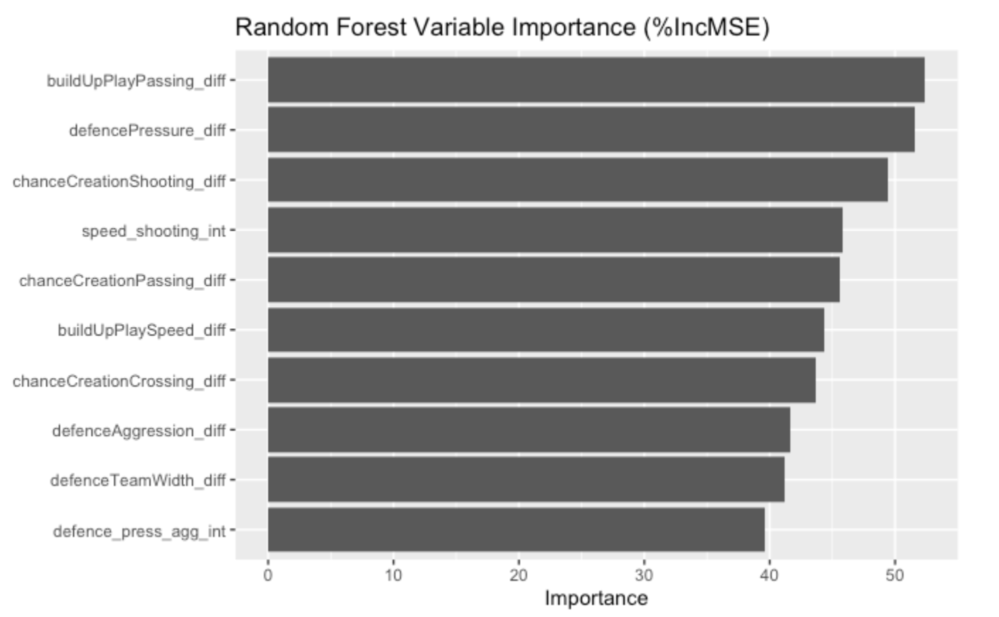

```{r setup, include=FALSE}
knitr::opts_chunk$set(echo = FALSE)
```

## Overview
The goal of our project was to predict the match outcome (home win, tie, home loss) of the home team in 2017 soccer season using data from the seasons 2008-2016. We split this up into three tasks:

- Task 1: Data preparation

- Task 2: Classification

  - Predicting match outcomes (win at home, tie, loss at home)

- Task 3: Regression

  - Predicting the number of goals scored in a match

## Data
We used the European soccer database from kaggle (https://www.kaggle.com/datasets/hugomathien/soccer/data). This database includes:

- data from over 25,000 matches

- over 10,000 players

- 11 European countries

- data from the 2008-2016 seasons

## Models Used 

Predicting Match Outcomes - Classification:

  - Logistic Regression

    - Used basic multinomial logistic regression for a baseline model to test for linear trends

  - K Nearest Neighbors (KNN)

    - Used KNN to test for Non-Linear trends

Predicting Goals Scored - Regression:
  - Polynomial Linear Regression

    - Used basic polynomial linear regression for a baseline model

      - Linear

      - Quadratic

      - Cubic

  - Random Forest Regression

    - Different Model to compare results with


## Data Preparation
Data is split into two groups:

- Train data: 2008-2016 seasons

- Test data: 2017 season


## Task 1: Predicting Match Outcomes

## Logistic Regression

## K Nearest Neighbors

## Task 2: Predicting Goals Scored

- Used Linear Regression, Quadratic Regression, Cubic Regression, and Random Forest Regression to model how many goals the home team will score in a given Soccer game.

## Linear Regression

<div class="columns">
<div class="column" width = "40%">

- Error metrics from testing data set.
- Average Predicted MSE: 1.6359
  - The model is roughly off by $\sqrt1.6359$ = 1.2790 goals per game on average.
  - Because soccer scoring is low and discrete, linear regression usually underfits and yields higher MSE.
  

</div>
<div class="column" width = "60%">

```{r Linear_Plot, echo=FALSE, fig.align="center", out.width="90%"}
knitr::include_graphics("Pictures/Linear_Plot.png")
```
</div>
</div>

## Quadratic Regression

<div class="columns">
<div class="column" width = "40%">

- Error metrics from testing data set.
- Average Predicted MSE: 1.6357
  - The model is roughly off by $\sqrt1.6357$ = 1.2789 goals per game on average.
  - If MSE improves substantially, it means the relationship between team attributes and goals is curved rather than straight.

</div>
<div class="column" width = "60%">

```{r Quad_Plot, echo=FALSE, fig.align="center", out.width="90%"}
knitr::include_graphics("Pictures/Quad_Plot.png")
```
</div>
</div>

## Cubic Regression

<div class="columns">
<div class="column" width = "40%">

- Error metrics from testing data set.
- Average Predicted MSE: 1.6280
  - The model is roughly off by $\sqrt1.6280$ = 1.2759 goals per game on average.
  - If MSE does not decrease meaningfully, then goals do not respond in a highly nonlinear cubic fashion.

</div>
<div class="column" width = "60%">

```{r Cubic_Plot, echo=FALSE, fig.align="center", out.width="90%"}
knitr::include_graphics("Pictures/Cubic_Plot.png")
```
</div>
</div>

## Random Forest Regression

<div class="columns">
<div class="column" width = "40%">

- Error metrics from testing data set.
- Average Predicted MSE: 1.6859
  - The model is roughly off by $\sqrt1.6859$ = 1.2984 goals per game on average.
  - Because soccer scoring is low and discrete, linear regression usually underfits and yields higher MSE.

</div>
<div class="column" width = "60%">

```{r RF_plot, echo=FALSE, fig.align="center", out.width="90%"}
knitr::include_graphics("Pictures/RF_plot.png")
```
</div>
</div>

## Random Forest Importance

<div class="columns">
<div class="column" width = "40%">

- The model relies most on passing quality, defensive pressure, and shooting creation. These features drive forecast accuracy, while defensive structure and interaction terms contribute less.

</div>
<div class="column" width = "60%">

```{r RF_Imp_Plot, echo=FALSE, fig.align="center", out.width="90%"}

```
</div>
</div>

## Results and Reflection

- Best Classification Model: K Nearest Neighbors
  - Average of % accuracy

- Best Regression Model: Undetermined - all MSE around 1.6
  - We chose Random Forest Regression because the fitted regression line seems to be closest to actual trend of data, but its open to interpretation.
  
- Reflection (Things to Improve on):
  - Could have included more match-specific information like recent team form, last-5 goal totals, rolling averages of chances/shots, etc. could have reduced the model’s tendency to predict values near the mean.
  - Could have added player-level strength instead of only team ratings such as average overall rating of expected starters, attacking/defensive overall, or key-player availability. This could raise predictive power because goals depend heavily on who is actually on the field, not just team-level attributes.
