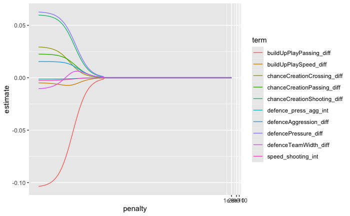

```{r setup, include=FALSE}
knitr::opts_chunk$set(echo = FALSE)
```

## Overview
The goal of our project was to predict the match outcome (home win, tie, home loss) of the home team in 2017 soccer season using data from the seasons 2008-2016. We split this up into three tasks:

- Task 1: Data preparation

- Task 2: Classification

  - Predicting match outcomes (win at home, tie, loss at home)

- Task 3: Regression

  - Predicting the number of goals scored in a match

## Data
We used the European soccer database from kaggle (https://www.kaggle.com/datasets/hugomathien/soccer/data). This database includes:

- data from over 25,000 matches

- over 10,000 players

- 11 European countries

- data from the 2008-2016 seasons

## Models Used 

Predicting Match Outcomes - Classification:

  - Logistic Regression

    - Used basic multinomial logistic regression for a baseline model to test for linear trends

  - K Nearest Neighbors (KNN)

    - Used KNN to test for Non-Linear trends

Predicting Goals Scored - Regression:
  - Polynomial Linear Regression

    - Used basic polynomial linear regression for a baseline model

      - Linear

      - Quadratic

      - Cubic

  - Ridge Regression

    - Different Model to compare results with


## Data Preparation
Data is split into two groups:

- Train data: 2008-2016 seasons

- Test data: 2017 season

## Task 1 Code and Models

Logistic Regression:

K Nearest Neighbors:

## Task 2 Code and Models

## Polynomial Linear Regression

## Ridge Regression

<div class="columns">
<div class="column" width = "40%">

- Error metrics for both testing data set and training data split into training and testing sets
- Significant terms:
  - 

</div>
<div class="column" width = "60%">

```{r RR_plot_1, echo=FALSE, fig.align="center", out.width="90%"}

```
</div>
</div>

## Results
